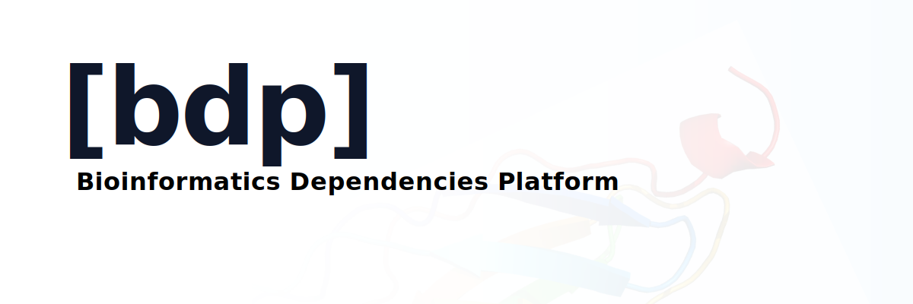

<div align="center">



[](./LICENSE)
[](https://github.com/datadir-lab/bdp/actions)
[](https://github.com/datadir-lab/bdp/releases)
[](https://www.rust-lang.org)
[](https://bdp.datadir.dev/docs)

**A dependency manager for biological databases**—treating UniProt, NCBI, and other data sources like software packages with version control and lockfiles.

Labs spend **4-12 hours per project** on manual data management. With BDP, it takes **~15 minutes**.

</div>

---

## Why BDP?

Only 11% of bioinformatics studies can be reproduced ([Leipzig et al., 2021](https://academic.oup.com/bib/article/24/6/bbad375/7326135)), with data versioning being a major factor. BDP solves this by:

- **Version Control** - Lock exact data versions with lockfiles (like `package-lock.json`)
- **Reproducible Builds** - Team members get identical datasets with `bdp pull`
- **Audit Trail** - Regulatory-compliant logs (FDA 21 CFR Part 11, NIH DMS, EMA ALCOA++)
- **Zero Manual Work** - No more download scripts, checksum verification, or version coordination

## Quick Start

```bash
# Install
curl --proto '=https' --tlsv1.2 -LsSf https://github.com/datadir-lab/bdp/releases/latest/download/bdp-installer.sh | sh

# Create project
bdp init
bdp source add "uniprot:P01308-fasta@1.0"  # Insulin protein
bdp pull

# ✅ Done! Data downloaded, checksums verified, lockfile created
```

**What you get:**
- `bdp.yml` - Your data dependencies (like `package.json`)
- `bdl.lock` - Exact versions for reproducibility (like `package-lock.json`)
- `data/` - Downloaded datasets with verified checksums

## Supported Data Sources

UniProt · NCBI Taxonomy · GenBank/RefSeq · Gene Ontology

## Status

| Component | Status |
|-----------|--------|
| CLI, Backend, Ingestion, Audit | ✅ Complete |
| Web Interface | ✅ Complete |
| Production Data | 🚧 In Progress |

## Documentation

- **[Installation Guide](./docs/INSTALL.md)** - Get started
- **[Quick Start](./docs/QUICK_START.md)** - 5-minute tutorial
- **[Full Documentation](./docs/INDEX.md)** - Complete documentation index
- **[Web Docs](https://bdp.datadir.dev/docs)** - Online documentation

## Development

```bash
# Clone and setup
git clone https://github.com/datadir-lab/bdp.git && cd bdp
docker-compose up -d

# Services
# API: http://localhost:8000
# MinIO: http://localhost:9001
# PostgreSQL: localhost:5432
```

See **[Development Setup](./docs/SETUP.md)** for details.

## Architecture

- **CLI/Server**: Rust (axum, SQLx, mediator CQRS pattern)
- **Database**: PostgreSQL 16
- **Storage**: MinIO/S3
- **Frontend**: Next.js 16
- **Infrastructure**: Terraform + OVH Cloud

## Contributing

See **[CONTRIBUTING.md](./CONTRIBUTING.md)** for guidelines.

## License

[LICENSE](./LICENSE)

## Contact

**Email**: sebastian.stupak@pm.me  
**Issues**: https://github.com/datadir-lab/bdp/issues
